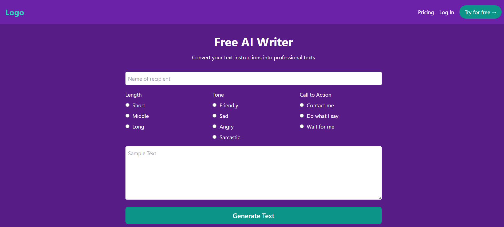

<h1>Free AI Writer</h1>

Free AI Writer is a web application designed to convert user-defined text instructions into professional texts. With a user-friendly interface, it allows users to specify the recipient's name, desired text length, tone, and call to action.
<h2>General Information</h2>

<ul>
<li>Features
Customizable Inputs: Users can specify:</li>
</ul>

Recipient's name
Length of the text (Short, Middle, Long)
Tone (Friendly, Sad, Angry, Sarcastic)
Call to Action (Contact me, Do what I say, Wait for me)
Text Generation: Generate high-quality texts based on the selected criteria.
<ul>
<li>It allows users to specify the recipient's name, desired text length, tone, and call to action.</li>
</ul><ul>
<li>TO convert user-defined text instructions into professional texts</li>
</ul><h2>Technologies Used</h2>

<ul>

  <h3 align="left">Programming and Technologies</h3>

   

  
</ul><h2>VIEW OF THE PROJECT</h2>

<h2>Usage</h2>

Enter the name of the recipient. 
Select the desired length of the text. 
Choose the tone of the message. 
Specify the call to action. 
Enter any sample text (optional). 
Click on the "Generate Text" button to create your professional text.

